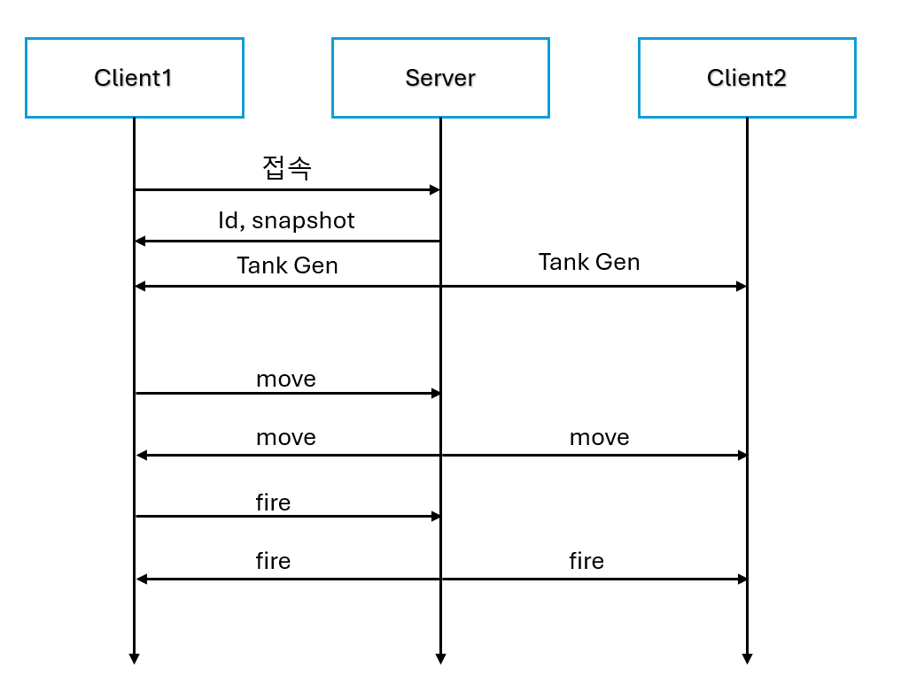

# 탱크 대전 게임

사용 언어: C/C++

VCS: TFVC -> git

저장소 주소: https://github.com/SeungjunPi/Tank

실행: 프로젝트의 exe 폴더 내 Sentinel 실행 후 Tank 실행

## 서버

IOCP 기반 NetCore DLL

​	Receive 로직

​	Send 로직

​

메인 로직은 싱글스레드 기반

​	특징: 서버 주도 피격 판정, 서버와 클라이언트가 충돌 로직을 공유함, 상태기반 업데이트를 통한 네트워크 부하 감소 및 클라이언트 수용량 증가

## 클라이언트

터미널의 텍스트 기반 게임

조작

​	W/S: 앞/뒤 이동

​	A/D: 좌/우 회전

​	space: 총알 발사

​	esc: 종료

## 서버-클라이언트 통신

### 유저

처음 접속 시 id와 snapshot을 전달하는것 외에는 대부분 broadcast 처리.

### 이동 처리

이동 시작과 종료만 클라이언트가 서버로 전달하는 방식으로 동작

클라이언트는 이벤트 발생 시 이동 시작에 앞/뒤/좌/우가 담긴 플래그를 전달

이동 처리는 클라이언트에서 각자 처리함

종료 시 클라이언트는 앞/뒤/좌/우가 담긴 플래그를 자신의 위치와 함께 보내며, (임시)서버는 이를 받아서 업데이트하고 다른 유저에게 broadcast.

### 투사체 관련

이동 처리는 각자 알아서 하며, 피격 판정만 서버에서 수행한 후 클라이언트로 전달함.

## (추가 중) DB 쓰레드

접속 시 유저 확인 단계를 예로 들어 설명함.

### 시작

### DB 함수 호출

- 쿼리문은 DB 라이브러리 내부에서 작성되며, 외부에선 함수만 호출함
- 메인 쓰레드에서 Validation 함수를 호출하며 ID와 PW를 넘겨줌
- 함수에서 쿼리를 생성, InQueue에 삽입
- 워커를 깨우는 이벤트 발생

### 워커 동작

이 부분은 순차적으로 설명함. 

1. 워커가 메인의 신호에 의해 깨어남

2. 쿼리를 꺼냄

3. 꺼낸 쿼리를 DB에 전달

4. 받은 쿼리를 결과로 변환

5. 변환한 결과를 Back Out Queue에 삽입

6. In Queue가 비었다면 다시 Wait, 아니면 InQueue에서 꺼내는 동작부터 다시 수행

### 메인의 쿼리 결과 처리

1. 결과를 처리하기위해 BeginHandleResults() 호출
   1. (동시에 처리하는 현상 방지용) 처리중 플래그를 on으로 변경
   2. main에서 결과를 끊임없이 처리하기 위해 Front, Back Queue를 Swap

2. Front Out Queue에서 결과를 꺼내서 처리

3. 빌 때까지 처리 후, 처리 중 flag를 off로 변경. 

# 수정/변경/추가 예정인 것들

## 변경

### 게임 로직

- snapshot 전달 시 모든 object를 전달하게 변경

- 네트워크 트래픽을 감소시키기 위한 이동 로직 변경
  - ~~이동 중 상태면 서버와 각 클라이언트에서 자체적으로 이동~~ (적용)
  - 이동 중에 주기적으로 보내는 클라이언트의 보고와 서버의 업데이트를 바탕으로 변경

## 추가

- 장애물
  - 서버 주도 생성

- 점수
  - 장애물을 맞추면 1점, 적을 맞추면 1점, 적을 격추시키면 10점, 자신이 격추당하면 -10점
- 클라이언트 카메라 및 카메라 이동
- AOI
- 서버 주도로 탱크 리스폰

### DB

- DB 쓰레드 추가
- id/pw 추가
- 유저 로그인 및 점수 기록
