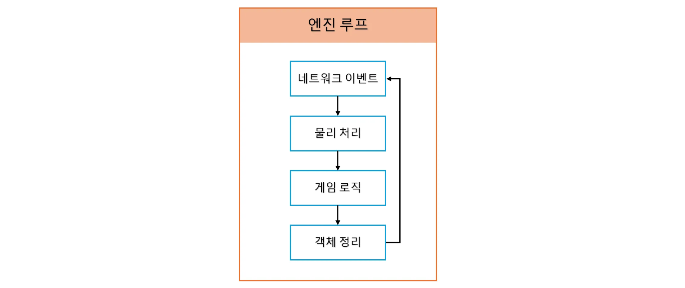
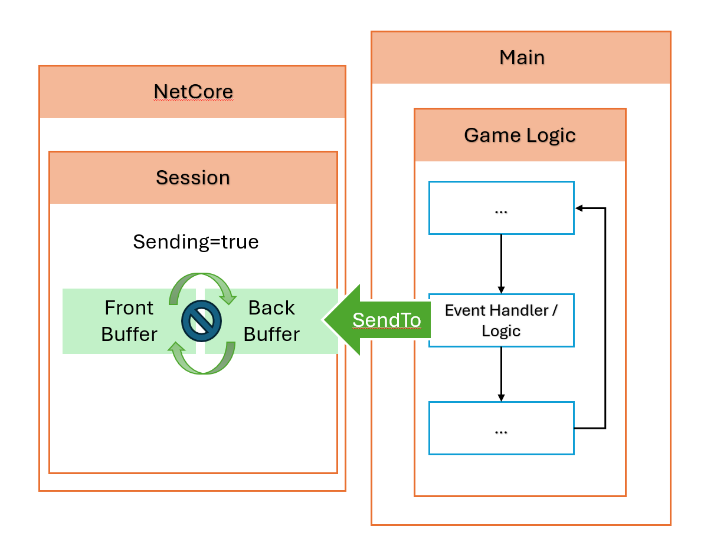
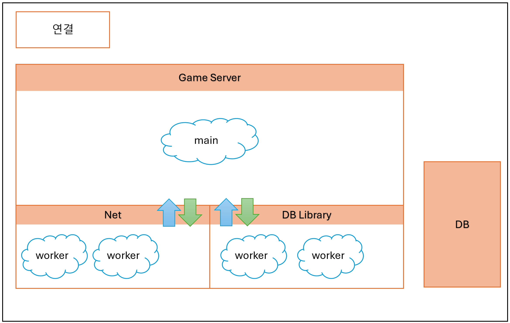
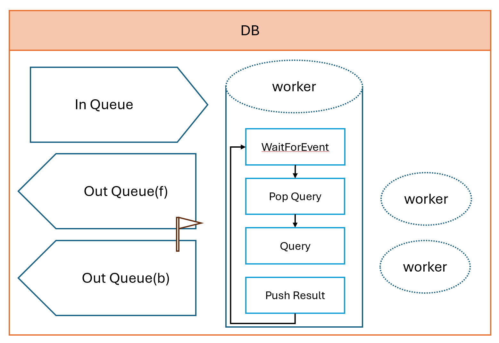
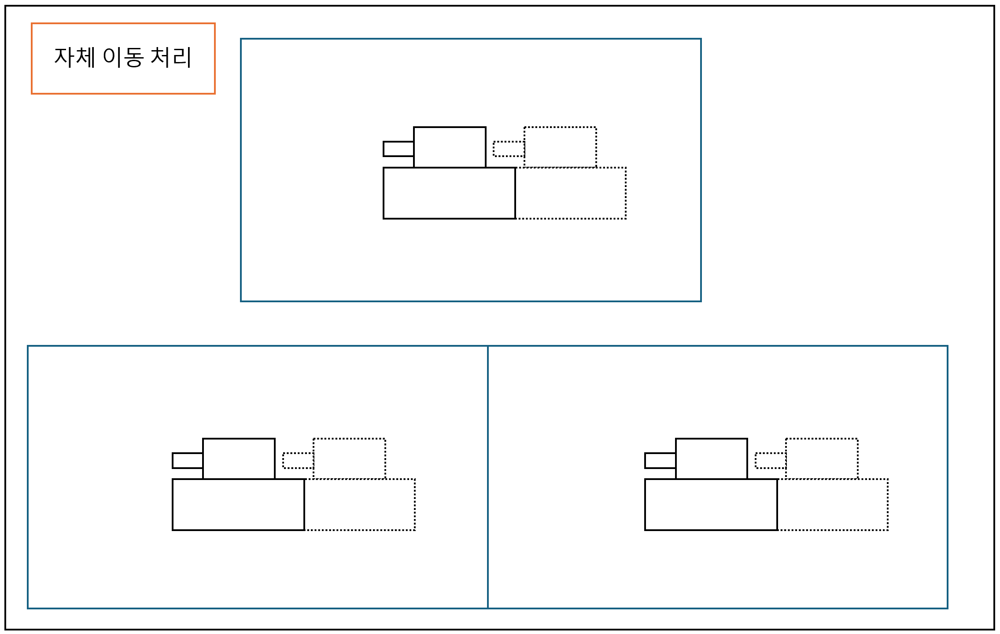
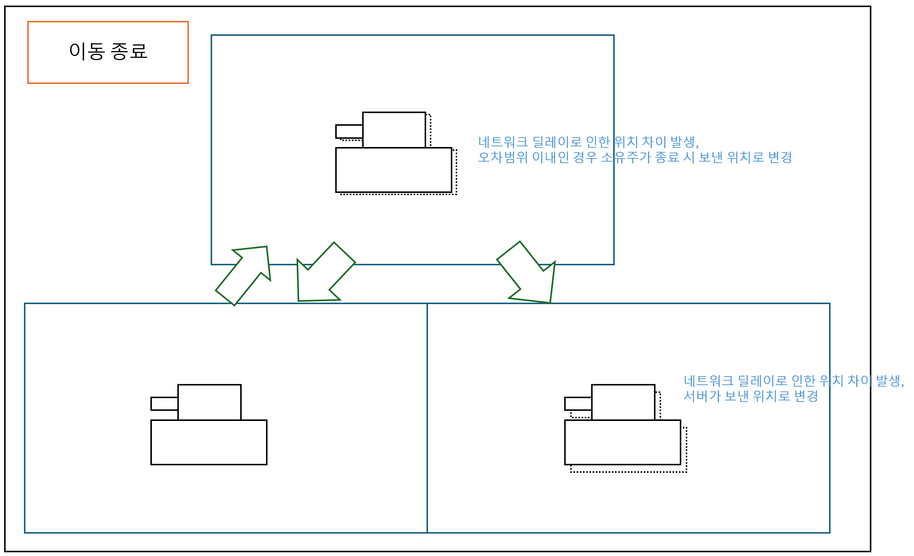

# 탱크 대전 게임

저장소 주소: https://github.com/SeungjunPi/Tank

유튜브 영상: https://youtu.be/G60u82f4WyU

## 목표

Windows 서버에서 동작하는 고성능 Stateful MMORPG 서버

### 개발 환경

- OS: Windows
- IDE: Visual Studio 2022
- DB: SQL Server 2022
- 언어: C++

### 특징

- 서버와 클라이언트의 엔진 공유
- 판정의 엄밀성을 위한 서버 주도 판정
- 유저의 이벤트 기반 동기화를 통한 서버의 최대 수용량 증대
- 클라이언트와 서버의 개발 편의성을 위해 각종 공통 라이브러리 분리

### 구현된 기능

- 실시간 동기화
- PVP
- 더미

## 프로젝트 별 역할

### 앱

- Sentinel
    - 공통 엔진 기반 서버
- Tank
    - 공통 엔진 기반 클라이언트
    - 터미널의 텍스트 기반
- 더미
    - 동작 및 부하 테스트를 위한 Tank 기반의 앱
    - 더미를 기반으로 몬스터를 추가하고 AI까지 추가하는 방안 고려 중

### 라이브러리

- NetCore
    - 비동기 멀티쓰레드 네트워크 라이브러리
- Math
    - 벡터, 사원수 계산 라이브러리
- DataStruct
    - 빠른 동작을 위해 직접 작성한 자료구조 라이브러리
- Collision
    - 충돌 감지 라이브러리
    - 앱에 있는 공통 물리 처리 로직을 포함하고 물리로 변경 예정
- DB
    - DB와 통신 담당
    - Sentinel에 포함돼있으며, 추후 분리 예정

## 게임 엔진

기본 루프를 서버, 클라이언트, 더미가 공유하며, 사용 시 약간의 차이가 있음.

## 설명

### NetCore

- IOCP 기반 네트워크 라이브러리.
- 핸들 등의 통신 핵심 리소스를 외부에 직접 노출하지 않음.
- 받은 패킷을 NetMessage로 변경 후 공통 Buffer에 쌓으며, 읽어서 처리하는 것은 main의 몫.

Receive 과정

Send 과정(성공 시)

Send 과정(이미 해당 Session에 대해 Send중일 시)

### Sentinel (서버)

구름 모양은 쓰레드를 의미

엔진 루프에 DB 이벤트가 네트워크 이벤트 직후에 처리됨. 

### DB

유저의 ID, PW, 점수가 저장돼있음.

현재 Main의 DB 요청에 대한 순서 보장 등의 동작은 고려하지 않고 있음.

## 동기화 방법

### 이동 처리

이동 시작, 종료, 이동 중을 클라이언트가 서버로 전달.

이동 이벤트 발생 시 플래그 전달

클라이언트와 서버 각각 이동 처리

이동 종료 시 서버에서 수용 가능한 범위인지 판단해서 처리. 이동 중 패킷도 같은 동작을 함.

### 투사체 판정

생성은 서버가 지시, 클라이언트는 요청만 함

---

### 구현 예정 기능

- 다양한 무기
- 다양한 재화
- 적 생성 및 AI
- 다양한 특성의 맵 및 맵 간 이동
- 인던
